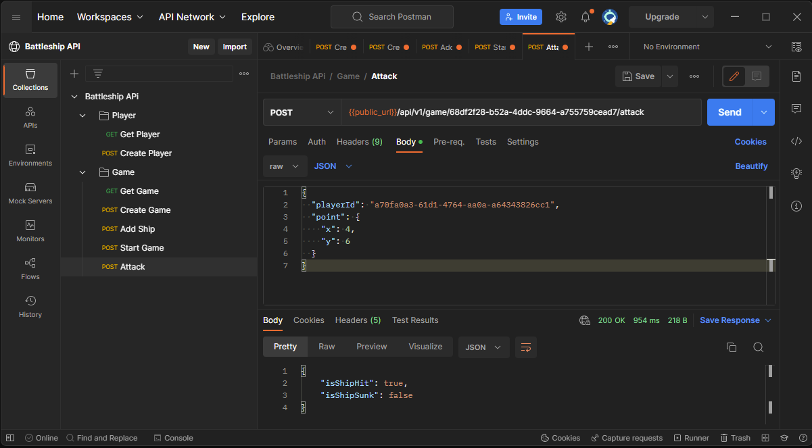

# Battleship Game API

# Overview
This is a basic Battleship API that supports the API endpoints required to run a battleship game. The API supports the following.

* Creating players
* Creating a single player game for a player, with a computer driven opponent.
* Creating ships within the players game board
* Starting the game
* Attacking the opponents ships

# Tech Stack and deployment environment 
The application is built on .NET Core 7, EF Core and a supporting framework [Mass Transit](https://masstransit-project.com/) for mediator capabilities, also leveraging DDD practices and patterns. The application runs with an In-Memory database to save cost, but can be easily extended to leverage a relational database as the application relies on [Entity Framework](https://learn.microsoft.com/en-us/ef/) Core for its ORM capabilities.

The application is also deployed to run with an In-Memory database to save cost, but can be easily extended to leverage a relational database as the application relies on [Entity Framework](https://learn.microsoft.com/en-us/ef/) Core for its ORM capabilities.

This application supports docker, and is currently containerized and hosted in within [AWS App Runner](https://aws.amazon.com/apprunner/) service.

**Public Endpoint**: https://nrezqxpauh.us-east-1.awsapprunner.com

**Swagger URL** : https://nrezqxpauh.us-east-1.awsapprunner.com/swagger/index.html

 # Opponent Behaviour
This API current has opponent functionality disabled for simplicity, which means the opponent will not attack your board. However the player can attack the opponents board. Also for simplicity the opponents board is configured to spawn static ship placements to allow validate API functionality. The generated opponents board can be seen in the image below.

The `/api/v1/game/{gameId}/attack` endpoint can be used to attack the opponents board. Please follow the instructions in the Invoking the API section to help create a game, start and attack the opponents board. 

# Invoking the API via Postman
Invoking the API can be done by forking the public workspace below. Follow the steps detailed below to run and test the API behaviour.

### 1. Create a player
The first step is to creat a player. Run the `Create Player` API request via Postman with a valid player name. This will return a player ID.

### 2. Create a game
Next create a game using the player ID. Run the `Create Game` API request via Postman with a valid player ID. This will return a game ID. At this moment the system will assign a system player as the opponent with the static placements of ships as describe earlier.

### 3. Place your ships
Players place your ships within the board within the the bounds of X(0-9) and Y(0-9). Run the `Add Ship` API request via Postman with a valid Game ID and player ID . Please the opponent attacks are disabled so your board will not be attacked by the opponent.

### 4. Start the game
After ships are placed you can start the game. Run the `Start Game` API request via Postman with a valid Game ID.

### 5. Attack
You can attack the opponents ships coordinates (refer to the opponent ship placement image above) to hit opponent ships. Run the `Attack` API request via Postman with a valid game ID, player ID, and X/Y coordinates.

### 6. View game status
You can always query the entire game object to determine the state of the game at anygiven point. Run the `Get Game` API request via Postman with a valid game ID. The response will include the player and the opponents game boards and the state tracked during the battle (e.g. coordinates hit, ship suck, etc.).

# Invoking the API locally
The API can also be run locally via and IDE such as Visual Studio 2022, latest version of Rider or even vs Code. Please make sure you have the latest version of .NET (dotnet 7) to ensure the application can be compiled and run.

Upon pulling the code down open the solution, set the startup project to the `\src\Ofx.Battleships.Api\Ofx.Battleships.Api.csproj` and run the application.

# Next Steps
* Enable opponent attack capability, after each player move. 
* Move from an In-Memory database to a relational database.
* Implement IaC via Terraform/CDK.
* Update and enhance more unit test scenarios to cover core logic.